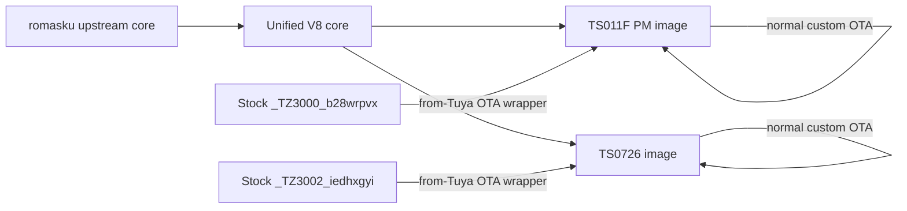

# Tuya Zigbee Switch — BSEED unified V8

Hardware-focused custom Zigbee firmware for selected BSEED devices, built on top of [romasku/tuya-zigbee-switch](https://github.com/romasku/tuya-zigbee-switch).

[](https://github.com/analienx/tuya-zigbee-switch/actions/workflows/test.yml)
[](https://github.com/analienx/tuya-zigbee-switch/actions/workflows/pm-reproducibility.yml)
[](https://github.com/analienx/tuya-zigbee-switch/actions/workflows/bseed-ota-distribution.yml)

> [!IMPORTANT]
> This repository supports **exact hardware/Zigbee identities**, not product appearance alone. BSEED sells visually similar devices with different internals. Verify the target before installing firmware.

## What this fork adds

- **One maintained V8 core, separate hardware images** for the supported BSEED families.
- **BL0937 power monitoring** for the validated TS011F PM socket target, using hardware-proven sampling semantics.
- **BSEED TS0726 support** on the same common-core architecture.
- **Stock-Tuya → custom OTA wrappers** for the exact supported stock identities.
- **Safer configuration and NVM handling**, including bounded parsing and migration guards.
- **Actions-only deployable artifacts** with pinned real-Telink builds, OTA-header checks and byte-for-byte reproducibility gates.

## Supported BSEED targets

| Device family | Exact identity | Board | Current custom firmware | Custom OTA image type |
|---|---|---|---|---:|
| TS011F power-monitoring socket | `b28wrpvx / TS011F-BS-PM` | `OUTLET_BSEED_PM_TS011F` | `1.2.5-bseedv8u3` · `0x12053006` | `43556` |
| TS0726 3-gang switch/dimmer | `iedhxgyi / TS0726-3-BS` | `SWITCH_BSEED_TS0726_3GANG` | `1.1.8-bseedv8` · `0x1102300a` | `45577` |

Both custom images use manufacturer code `4417`.

**The two targets use different binaries. Never flash a TS011F-PM image onto a TS0726 device, or vice versa.**

### Supported stock conversion identities

| Stock Zigbee identity | Stock OTA image type | Conversion target |
|---|---:|---|
| `_TZ3000_b28wrpvx / TS011F` | `54179` | TS011F PM unified V8 |
| `_TZ3002_iedhxgyi / TS0726` | `54179` | TS0726 unified V8 |

The stock-facing wrappers use outer OTA version `0xFFFFFFFF`; after conversion, normal custom→custom updates use the target-specific custom image type and version.

## Quick start with Zigbee2MQTT

Use the dedicated BSEED OTA index rather than historical generic fork entries:

```text
https://raw.githubusercontent.com/analienx/tuya-zigbee-switch/main/zigbee2mqtt/ota/index_bseed.json
```

In Zigbee2MQTT, set it as the OTA override index and restart Zigbee2MQTT:

```yaml
ota:
  zigbee_ota_override_index_location: >-
    https://raw.githubusercontent.com/analienx/tuya-zigbee-switch/main/zigbee2mqtt/ota/index_bseed.json
```

The index contains exactly four manufacturer-specific paths: normal + stock-conversion OTA for each supported BSEED family.

For complete update/conversion steps, see [Updating OTA](docs/updating.md) and the [BSEED unified V8 guide](docs/bseed_unified_v8.md).

## Architecture



The conversion wrappers contain the **same compiled Telink payload** as their corresponding normal image. Validation permits only the expected outer OTA-header identity/version bytes to differ.

## Release integrity

Deployable BSEED firmware is produced by **GitHub Actions only**. Local compiler outputs are useful for diagnostics, but are not authoritative release candidates.

The release path checks:

- host tests and lint;
- firmware image-type collision/identity rules;
- real pinned TC32 builds for both BSEED targets;
- exact OTA manufacturer/image/version headers;
- manifest provenance and clean-source state;
- a second PM build for byte-for-byte reproducibility;
- normal-vs-from-Tuya payload identity;
- generated OTA index consistency.

The PM release `0x12053005` is intentionally reserved as a known-good recovery slot; normal development advanced past it to `0x12053006`.

## Safety

> [!CAUTION]
> Custom firmware can make a mains-powered device unusable. A successful stock→custom conversion does **not** prove that stock firmware can later be restored.

Before converting a stock device:

1. Match the **exact Zigbee manufacturer/model identity** shown above.
2. Do not infer compatibility from the enclosure or retail model name.
3. Treat conversion as potentially one-way unless you have a full original-firmware backup and a tested restore method for that exact hardware.
4. Keep power stable during OTA.

For the validated PM socket, the canonical custom configuration is:

```text
b28wrpvx;TS011F-BS-PM;LC3;SB5u;RD2;IB4;M;
```

## Documentation

| Topic | Document |
|---|---|
| Architecture, identities, conversion and validation | [BSEED unified V8](docs/bseed_unified_v8.md) |
| OTA conversion and updates | [Updating OTA](docs/updating.md) |
| Supported hardware database | [Supported devices](docs/supported_devices.md) |
| Firmware changes | [Firmware changelog](docs/changelog_fw.md) |
| Known limitations | [Known issues](docs/known_issues.md) |
| Porting new hardware | [Porting guide](docs/contribute/porting.md) |

## Contributing and support

Contributions are welcome, especially when they keep hardware-specific behavior behind explicit target guards and preserve the shared upstream architecture.

- [Contributing](CONTRIBUTING.md)
- [Support / bug-reporting guidance](SUPPORT.md)
- [Security policy](SECURITY.md)

For firmware changes, pull requests should keep deployable artifacts Actions-produced and preserve the normal CI + real-Telink validation boundary.

## Upstream and license

This project is a fork of [romasku/tuya-zigbee-switch](https://github.com/romasku/tuya-zigbee-switch). BSEED-specific changes are kept reviewable and compatible with the upstream architecture where practical.

See [LICENSE](LICENSE) for licensing terms.
